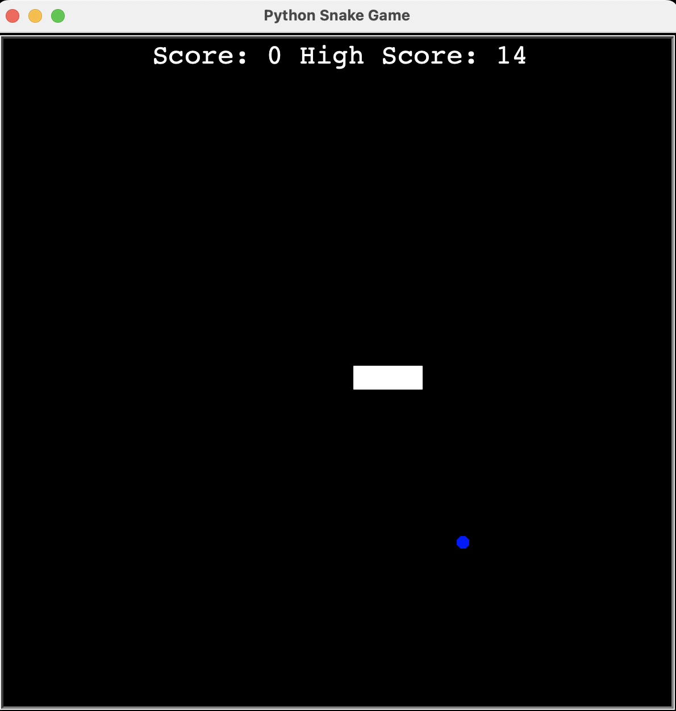

# Snake Game 

  ## Description

  This is a re-creation of the Snake Game (built with Python) where the "snake" is controlled using the keyboard directional keys and is steered to eat food that is randomly generated on the screen.  As food is eaten the snake grows and the player must keep the snake within the bounds of the screen and avoid collisions with itself.
  
  Screenshot:

  
  

  ## Table of Contents
  
  - [Installation](#installation)
  - [Usage](#usage)
  - [License](#license)
  - [Contributing](#contributing)
  - [Tests](#tests)
  - [Questions](#questions)
  
  ## Installation
  
  run main.py from terminal
  
  ## Usage
  
  Steer snake with directional keys, eat food, and avoid collisions with screen walls and collisions with its own tail.  Score is incremented upon eating randomly generated food particles.

  ## License
This application is covered under the MIT License.
 For more information: https://opensource.org/licenses/MIT
  
  ## Contributing
  N/A
  
  ## Tests
  N/A

  ## Questions
  Contact Info 
  GitHub user name: BillStephens2022 
  Link to GitHub profile: https://github.com/BillStephens2022 
  Email: stephensbill17@gmail.com